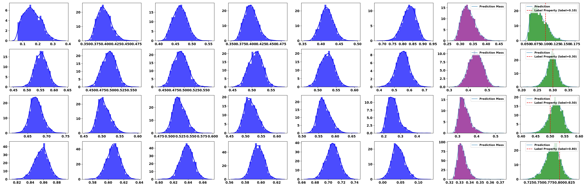

# Paper

This repository is the official implementation of [RCGAN-Based Inverse Design and Multi-Objective Optimization Using Customizable Weight Vectors for Lattice Structure Design ](xxx). 

## Abstract

Mechanical metamaterials are engineered structures designed to exhibit unique and extraordinary mechanical properties. Traditionally, their design relied on trial-and-error methods, which are slow and limited. With the rise of machine learning, inverse design methods now provide a more efficient and systematic approach. These methods allow for a broader exploration of material properties and support the integration of multifunctionality, significantly speeding up the design process. Despite the many advantages of inverse design, lattice structures often require a trade-off between compactness and manufacturability to achieve the same target properties. Furthermore, these trade-offs must be dynamically adjusted based on different additive manufacturing conditions. To address this, we propose the RCGAN-MO architecture, which simultaneously handles the inverse design and adjustable multi-objective optimization of mechanical metamaterials. The RCGAN-MO consists of two trained neural networks: a generator and a predictor, along with a weighted multi-objective optimizer, trained on a FEM dataset. As a case study, the RCGAN-MO architecture is applied to the inverse design of the relative compressive elastic moduli  for a lattice unit cell, and the impact of different weight vector values in the multi-objective optimizer is examined through 3D printed samples. The results show that: 1) The generator achieves high accuracy in both FEM simulations and compression tests, with R² values of 99.62% and 86.99%; 2) Optimizing for compactness makes the lattice unit cell harder to print, while prioritizing manufacturability improves printability, although it leads to an increase in lattice size.


## Requirements

To install requirements:

```setup
pip install -r requirements.txt
```

## Dataset

The initial dataset used for machine learning is below:
```dataset
ML\dataset\data_for_ml.csv
```

## Pre-trained Models

You can download pretrained models here:

- [Pre-trained models](https://drive.google.com/drive/folders/1NSqfPPsY1RPsla_znxMMUr7pr5FpA_6i?usp=drive_link)  
  - Forward prediction model
  - Inverse design model
    - Regressor
    - Generator
    - Discriminitor


## Parameter Configuration

Most hyperparameters are defined through the configuration file. If changes are needed, you can directly locate the relevant parameters in the file and modify them:

```parameter
ML\configs\nn.json
```
:exclamation: The `pth_address` in the JSON file refers to the location of the trained `.pth` model file. You can either train the model yourself by following the steps below or directly use `pre-trained models` and copy files to the `pth_address` directory.


## Training

The model definition and global variable declarations can be found at:

    ML\models\train_config.py

After tuning the training hyperparameters,

-Train the forward prediction model:  

    ML\models\nn\forward_train.py


-Train the inverse RCGAN prediction model:

    ML\models\gan\rcgan_train.py


## Evaluation

You can evaluate the model using the following methods::  

-Evaluate the forward prediction model:

    ML\models\nn\forward_eval.py

-Evaluate the inverse RCGAN prediction model:

    ML\models\gan\rcgan_eval.py

## Results

Our model achieves the following performance on :

### Accuracy

| Model name         | R2  |
| ------------------ |---------------- | 
| Forward prediction   |     99.72%         |
| Inverse design   |     97.2%         |

### Generative evaluation

RCGAN generation capability verification  (target = [0.0294,0.0406, 0.0517, 0.0685])

<div style="text-align: center;">
  
  <p>Generated results</p>
</div>

## Citation
If you use RCGAN-MO framework in your research or application, please consider citing it!

```citation
@article{,
    title={},
    author={},
    journal={},
    year={2025},
}
```